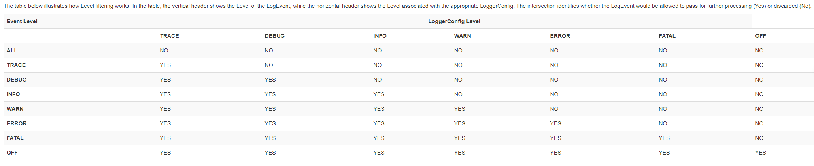
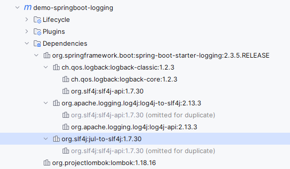

# 日志

## 日志框架

目前常用的日志框架有log4j,slf4j,,logback,这些日志框架可以分为两种类型：日志门面和日志实现

### 日志门面

只提供日志相关的接口定义，不提供具体地实现，日志门面必须配合日志系统使用，日志门面可以动态或静态的指定具体的日志框架实现，使用户可以灵活的选择。

门面日志框架包含：commons logging，slf4j

门面指的是外观模式，

### 日志实现

提供了日志接口的实现

日志实现框架包括log4j，JUL，logback。

- 参考：https://www.loggly.com/ultimate-guide/java-logging-basics/

- 参考：https://zhuanlan.zhihu.com/p/86249472

- 参考：https://zhuanlan.zhihu.com/p/365154773

- 参考：https://whatsrtos.github.io/Java/JavaEE-Log/

日志门面和日志实现的关系就像

## 演进

https://www.yuque.com/u21559410/xqh5kz/tcevtc7ulef4tnzb?inner=enOcZ

顺带一提，SpringBoot自带的日志体系是：slf4j和logback的组合，引入的其他日志框架如log4j会通过`log4j-to-slf4j`
重定向到slf4j实现，包括jul。

```xml

<dependencies>
    <dependency>
        <groupId>ch.qos.logback</groupId>
        <artifactId>logback-classic</artifactId>
        <version>1.2.3</version>
        <scope>compile</scope>
    </dependency>
    <dependency>
        <groupId>org.apache.logging.log4j</groupId>
        <artifactId>log4j-to-slf4j</artifactId>
        <version>2.13.3</version>
        <scope>compile</scope>
    </dependency>
    <dependency>
        <groupId>org.slf4j</groupId>
        <artifactId>jul-to-slf4j</artifactId>
        <version>1.7.30</version>
        <scope>compile</scope>
    </dependency>
</dependencies>
```

## Log4j

https://github.com/apache/logging-log4j1

使用参考

- 官方手册：https://logging.apache.org/log4j/1.2/manual.html
- https://www.jianshu.com/p/ccafda45bcea

目前`Log4j`已不再继续维护，因为有了更强大的`Log4j2`，所以这里强烈建议不再使用`log4j`。

`Log4j`是一种日志记录的实现。

### 日志级别

- TRACE
- DEBUG
- INFO
- WARN
- ERROR
- FATAL

从小到大为：`DEBUG < INFO < WARN < ERROR < FATAL`

### 核心组件

Log4j有三个核心组件，引用官方文档：`Log4j has three main components: loggers, appenders and layouts. These three types of components work together to enable developers to log messages according to message type and level, and to control at runtime how these messages are formatted and where they are reported. `

#### loggers

负责发送日志打印请求并决定该请求是否生效，负责定义每一个日志请求的日志级别，负责定义全局日志可输出级别，负责接受输出日志的内容（从程序获取的部分，如`log.info("this is an info level log.");`
中的`this is an info level log.`）

#### appenders

负责决定日志的输出目的，如`console`，`.log`文件等，也支持异步，一个`logger`可以对应多个`appenders`
，一个请求会被所有的`appenders`处理

#### layouts

负责定义输出格式

### 配置

```properties
log4j.rootLogger=INFO,A1               // 定义logger方式1: 定义根logger名=rootLogger, level=INFO, 使用名为A1的appender
log4j.logger.loggerName1=DEBUG,A2      // 定义logger方式2: logger名=loggerName1, 使用名为A2的appender
log4j.logger.org.apache=DEBUG, A3    // 定义logger方式3: 对org.apache下的类有效, 使用名为A3的appender
// 定义A1 appender的属性\
// 可选ConsoleAppender, RollingFileAppender ..
log4j.appender.A1=org.apache.log4j.DailyRollingFileAppender
log4j.appender.A1.BufferedIO=false
log4j.appender.A1.BufferSize=1024
log4j.appender.A1.file=../logs/api.log // 日志文件位置
log4j.appender.A1.DatePattern='.'yyyyMMddHH
log4j.appender.A1.layout=org.apache.log4j.PatternLayout
log4j.appender.A1.layout.ConversionPattern=%-d{yyyy-MM-dd HH\:mm\:ss SSS} [%p] %m%n // 日志格式
```

### 性能

---

## `J.U.L`(jdk-logging)

`java.util.logging` 简称`jul`，自jdk1.4开始存在，与Java绑定。
所以这也是Java使用日志最简单的方式，如果你的程序不需要很复杂的日志结构，且依赖受限，`JUL`将是你最好的选择。

参考

- 官方文档：https://docs.oracle.com/en/java/javase/11/docs/api/java.logging/java/util/logging/package-summary.html

- https://www.loggly.com/ultimate-guide/java-logging-basics/

- https://mkyong.com/logging/java-logging-apis-tutorial/

### 日志级别

官方文档：https://docs.oracle.com/en/java/javase/11/docs/api/java.logging/java/util/logging/Level.html

- SEVERE
- WARNING
- INFO
- CONFIG
- FINE
- FINER
- FINEST

从小到大为：`FINEST < FINER < FINE < CONFIG < INFO < WARNING < SEVERE`

### 核心组件

与`Log4j`相同，`Java logging`也有三个核心组件`logger`，`handler`（类似于`Log4j`的`appenders`），`formatter`（类似于`Log4j`
的`layouts`），功能也与`log4j`类似，这里不在展开详述。

### 配置

`J.U.L`默认会加载`logging.properties`。

- `$JAVA_HOME/jre/lib/`： Java 8及之前的版本的配置文件放在这个位置
- `$JAVA_HOME/conf` ： Java 9及之后的版本的配置文件放在这个位置

配置文件样例

```properties
# Logs to file and console
handlers=java.util.logging.FileHandler, java.util.logging.ConsoleHandler
# Global logging levels, 7 levels
.level=SEVERE
# Log file output in user's home directory, %h
java.util.logging.FileHandler.pattern=%h/java%u.log
java.util.logging.FileHandler.limit=50000
java.util.logging.FileHandler.count=1
java.util.logging.FileHandler.formatter=java.util.logging.XMLFormatter
# java.util.logging.FileHandler.formatter = java.util.logging.SimpleFormatter
java.util.logging.ConsoleHandler.level=INFO
java.util.logging.ConsoleHandler.formatter=java.util.logging.SimpleFormatter
java.util.logging.SimpleFormatter.format=[%1$tc] %4$s: %5$s %n
# log level for package
com.mkyong.level=SEVERE
```

除了默认的加载方式外，还可以通过其他方式加载配置文件

- 运行时指定加载文件

  ```sh
  # 通过相对路径指定日志文件位置
  $ java -jar -Djava.util.logging.config.file=./resource/logging.properties server.jar
  ```

- 通过LogManager加载配置文件

  ```java
  package com.test;
  
  import java.io.IOException;
  import java.io.InputStream;
  import java.util.logging.Level;
  import java.util.logging.LogManager;
  import java.util.logging.Logger;
  
  @SuppressWarnings("all")
  public class LoadLogProperties {
  
    static {
        // must set before the Logger
        // loads logging.properties from the classpath
        try (InputStream is = LoadLogProperties.class.getClassLoader().getResourceAsStream("logging.properties")) {
            LogManager.getLogManager().readConfiguration(is);
        } catch (IOException e) {
            e.printStackTrace();
        }
    }
  
    private static Logger logger = Logger.getLogger(LoadLogPropertiesFile.class.getName());
  
    public static void main(String[] args) {
  
        logger.info("This is level info logging");
  
    }
  
  }
  ```

- 通过系统变量加载配置文件

  ```java
    package com.demo;
    
    import java.io.IOException;
    import java.io.InputStream;
    import java.util.Objects;
    import java.util.logging.Level;
    import java.util.logging.LogManager;
    import java.util.logging.Logger;
    
    public class LoadLogPropertiesFile2 {
    
      static {
          // must set before the Logger
          // loads logging.properties from the classpath
          String path = Objects.requireNonNull(LoadLogPropertiesFile.class.getClassLoader().getResource("logging.properties")).getFile();
          System.setProperty("java.util.logging.config.file", path);
    
      }
    
      private static Logger logger = Logger.getLogger(LoadLogPropertiesFile.class.getName());
    
      public static void main(String[] args) {
    
          logger.info("This is level info logging");
    
      }
    
    }
  ```

## `J.C.L`(commons-logging)

Java commons logging 简称 `J.C.L`，

官方文档：https://commons.apache.org/proper/commons-logging/

wiki：https://cwiki.apache.org/confluence/display/commons/Logging

其他：

- https://www.logicbig.com/tutorials/misc/java-logging/apache-commons-logging.html

标准发行版中包含的Jars

- `commons-logging.jar`，有api，有Log及其实现类（除`SimpleLog、NoOpLog、Jdk14Logger`
  之外，还包括`Log4JLogger，LogKitLogger，Jdk13LumberjackLogger，AvalonLogger`），还有`LogFactory`及其实现类

- `commons-logging-api.jar`，有`api`
- `commons-logging-adapters.jar`

你可以认为`commons-logging = commons-logging-api + commons-logging-adapters`

大多数情况下，你只需要引用`commons-logging.jar`
和你想用的日志实现即可，会根据一定的逻辑来找到默认的日志记录器实现,如果没有配置日志实现类，则会默认使用`Jdk14Logger`。

### 日志级别

- fatal
- error
- warn
- info
- debug
- trace

日志级别从小到大为：`trace < debug < info < warn < error < fatal`

### 核心组件

#### Log

接口，日志记录器，会根据具体地实现调用对应的日志记录方式，如配置了`Log4j`就会根据`Log4j`的方式去发送日志消息。

#### LogFactory

可以创建Log实例。

### 配置

`JCL`找日志记录器实现的过程(`discovery process` )
可以参考如下代码：`commons-logging`包下`LogFactory`的实现方法,`org.apache.commons.logging.LogFactory.getFactory`

```java

@SuppressWarnings("all")
public abstract class LogFactory {

    public static LogFactory getFactory() throws LogConfigurationException {
        // Identify the class loader we will be using
        ClassLoader contextClassLoader = getContextClassLoaderInternal();

        if (contextClassLoader == null) {
            // This is an odd enough situation to report about. This
            // output will be a nuisance on JDK1.1, as the system
            // classloader is null in that environment.
            if (isDiagnosticsEnabled()) {
                logDiagnostic("Context classloader is null.");
            }
        }

        // Return any previously registered factory for this class loader
        LogFactory factory = getCachedFactory(contextClassLoader);
        if (factory != null) {
            return factory;
        }

        if (isDiagnosticsEnabled()) {
            logDiagnostic(
                    "[LOOKUP] LogFactory implementation requested for the first time for context classloader " +
                            objectId(contextClassLoader));
            logHierarchy("[LOOKUP] ", contextClassLoader);
        }

        // Load properties file.
        //
        // If the properties file exists, then its contents are used as
        // "attributes" on the LogFactory implementation class. One particular
        // property may also control which LogFactory concrete subclass is
        // used, but only if other discovery mechanisms fail..
        //
        // As the properties file (if it exists) will be used one way or
        // another in the end we may as well look for it first.

        Properties props = getConfigurationFile(contextClassLoader, FACTORY_PROPERTIES);

        // Determine whether we will be using the thread context class loader to
        // load logging classes or not by checking the loaded properties file (if any).
        ClassLoader baseClassLoader = contextClassLoader;
        if (props != null) {
            String useTCCLStr = props.getProperty(TCCL_KEY);
            if (useTCCLStr != null) {
                // The Boolean.valueOf(useTCCLStr).booleanValue() formulation
                // is required for Java 1.2 compatibility.
                if (Boolean.valueOf(useTCCLStr).booleanValue() == false) {
                    // Don't use current context classloader when locating any
                    // LogFactory or Log classes, just use the class that loaded
                    // this abstract class. When this class is deployed in a shared
                    // classpath of a container, it means webapps cannot deploy their
                    // own logging implementations. It also means that it is up to the
                    // implementation whether to load library-specific config files
                    // from the TCCL or not.
                    baseClassLoader = thisClassLoader;
                }
            }
        }

        // Determine which concrete LogFactory subclass to use.
        // First, try a global system property
        if (isDiagnosticsEnabled()) {
            logDiagnostic("[LOOKUP] Looking for system property [" + FACTORY_PROPERTY +
                    "] to define the LogFactory subclass to use...");
        }

        try {
            String factoryClass = getSystemProperty(FACTORY_PROPERTY, null);
            if (factoryClass != null) {
                if (isDiagnosticsEnabled()) {
                    logDiagnostic("[LOOKUP] Creating an instance of LogFactory class '" + factoryClass +
                            "' as specified by system property " + FACTORY_PROPERTY);
                }
                factory = newFactory(factoryClass, baseClassLoader, contextClassLoader);
            } else {
                if (isDiagnosticsEnabled()) {
                    logDiagnostic("[LOOKUP] No system property [" + FACTORY_PROPERTY + "] defined.");
                }
            }
        } catch (SecurityException e) {
            if (isDiagnosticsEnabled()) {
                logDiagnostic("[LOOKUP] A security exception occurred while trying to create an" +
                        " instance of the custom factory class" + ": [" + trim(e.getMessage()) +
                        "]. Trying alternative implementations...");
            }
            // ignore
        } catch (RuntimeException e) {
            // This is not consistent with the behaviour when a bad LogFactory class is
            // specified in a services file.
            //
            // One possible exception that can occur here is a ClassCastException when
            // the specified class wasn't castable to this LogFactory type.
            if (isDiagnosticsEnabled()) {
                logDiagnostic("[LOOKUP] An exception occurred while trying to create an" +
                        " instance of the custom factory class" + ": [" +
                        trim(e.getMessage()) +
                        "] as specified by a system property.");
            }
            throw e;
        }

        // Second, try to find a service by using the JDK1.3 class
        // discovery mechanism, which involves putting a file with the name
        // of an interface class in the META-INF/services directory, where the
        // contents of the file is a single line specifying a concrete class
        // that implements the desired interface.

        if (factory == null) {
            if (isDiagnosticsEnabled()) {
                logDiagnostic("[LOOKUP] Looking for a resource file of name [" + SERVICE_ID +
                        "] to define the LogFactory subclass to use...");
            }
            try {
                final InputStream is = getResourceAsStream(contextClassLoader, SERVICE_ID);

                if (is != null) {
                    // This code is needed by EBCDIC and other strange systems.
                    // It's a fix for bugs reported in xerces
                    BufferedReader rd;
                    try {
                        rd = new BufferedReader(new InputStreamReader(is, "UTF-8"));
                    } catch (java.io.UnsupportedEncodingException e) {
                        rd = new BufferedReader(new InputStreamReader(is));
                    }

                    String factoryClassName = rd.readLine();
                    rd.close();

                    if (factoryClassName != null && !"".equals(factoryClassName)) {
                        if (isDiagnosticsEnabled()) {
                            logDiagnostic("[LOOKUP]  Creating an instance of LogFactory class " +
                                    factoryClassName +
                                    " as specified by file '" + SERVICE_ID +
                                    "' which was present in the path of the context classloader.");
                        }
                        factory = newFactory(factoryClassName, baseClassLoader, contextClassLoader);
                    }
                } else {
                    // is == null
                    if (isDiagnosticsEnabled()) {
                        logDiagnostic("[LOOKUP] No resource file with name '" + SERVICE_ID + "' found.");
                    }
                }
            } catch (Exception ex) {
                // note: if the specified LogFactory class wasn't compatible with LogFactory
                // for some reason, a ClassCastException will be caught here, and attempts will
                // continue to find a compatible class.
                if (isDiagnosticsEnabled()) {
                    logDiagnostic(
                            "[LOOKUP] A security exception occurred while trying to create an" +
                                    " instance of the custom factory class" +
                                    ": [" + trim(ex.getMessage()) +
                                    "]. Trying alternative implementations...");
                }
                // ignore
            }
        }

        // Third try looking into the properties file read earlier (if found)

        if (factory == null) {
            if (props != null) {
                if (isDiagnosticsEnabled()) {
                    logDiagnostic(
                            "[LOOKUP] Looking in properties file for entry with key '" + FACTORY_PROPERTY +
                                    "' to define the LogFactory subclass to use...");
                }
                String factoryClass = props.getProperty(FACTORY_PROPERTY);
                if (factoryClass != null) {
                    if (isDiagnosticsEnabled()) {
                        logDiagnostic(
                                "[LOOKUP] Properties file specifies LogFactory subclass '" + factoryClass + "'");
                    }
                    factory = newFactory(factoryClass, baseClassLoader, contextClassLoader);

                    // TODO: think about whether we need to handle exceptions from newFactory
                } else {
                    if (isDiagnosticsEnabled()) {
                        logDiagnostic("[LOOKUP] Properties file has no entry specifying LogFactory subclass.");
                    }
                }
            } else {
                if (isDiagnosticsEnabled()) {
                    logDiagnostic("[LOOKUP] No properties file available to determine" + " LogFactory subclass from..");
                }
            }
        }

        // Fourth, try the fallback implementation class

        if (factory == null) {
            if (isDiagnosticsEnabled()) {
                logDiagnostic(
                        "[LOOKUP] Loading the default LogFactory implementation '" + FACTORY_DEFAULT +
                                "' via the same classloader that loaded this LogFactory" +
                                " class (ie not looking in the context classloader).");
            }

            // Note: unlike the above code which can try to load custom LogFactory
            // implementations via the TCCL, we don't try to load the default LogFactory
            // implementation via the context classloader because:
            // * that can cause problems (see comments in newFactory method)
            // * no-one should be customising the code of the default class
            // Yes, we do give up the ability for the child to ship a newer
            // version of the LogFactoryImpl class and have it used dynamically
            // by an old LogFactory class in the parent, but that isn't
            // necessarily a good idea anyway.
            factory = newFactory(FACTORY_DEFAULT, thisClassLoader, contextClassLoader);
        }

        if (factory != null) {
            /**
             * Always cache using context class loader.
             */
            cacheFactory(contextClassLoader, factory);

            if (props != null) {
                Enumeration names = props.propertyNames();
                while (names.hasMoreElements()) {
                    String name = (String) names.nextElement();
                    String value = props.getProperty(name);
                    factory.setAttribute(name, value);
                }
            }
        }

        return factory;
    }
}
```

我们也可以通过在`resource`目录下添加`commons-logging.properties`配置文件来指定使用哪个实现类

```properties
# 指定使用Jdk14Logger,如果不配置，但是maven引入了log4j一样的效果
org.apache.commons.logging.Log=org.apache.commons.logging.impl.Jdk14Logger
# 指定使用Log4JLogger，需要引用
# org.apache.commons.logging.Log=org.apache.commons.logging.impl.Log4JLogger
```

#### `JCL+Log4j 1`

##### POM

```xml

<dependencies>
    <dependency>
        <groupId>commons-logging</groupId>
        <artifactId>commons-logging</artifactId>
        <version>${commons-logging.version}</version>
    </dependency>
    <!-- 因为jcl已经存在了Log4j的实现，所以我们不需要任何桥接jar包来解决冲突 -->
    <dependency>
        <groupId>log4j</groupId>
        <artifactId>log4j</artifactId>
        <version>1.2.17</version>
    </dependency>
</dependencies>
```

##### 应用

```java
public class JCLApplication {
    private static final Log log = LogFactory.getLog(JCLApplication.class);

    public static void main(String[] args) {

        log.fatal("fatal");
        log.error("error");
        log.warn("warn");
        log.info("info");
        log.debug("debug");
        log.trace("trace");
    }
}
```

##### 配置文件

```properties
# 日志级别为DEBUG，输出位置为控制台
log4j.rootLogger=DEBUG,console
log4j.additivity.org.apache=true
# 控制台(console)
log4j.appender.console=org.apache.log4j.ConsoleAppender
log4j.appender.console.Threshold=DEBUG
log4j.appender.console.ImmediateFlush=true
log4j.appender.console.Target=System.err
log4j.appender.console.layout=org.apache.log4j.PatternLayout
log4j.appender.console.layout.ConversionPattern=%d{yyyy-MM-dd HH:mm:ss,SSS} %5p [%t] %l - %m%n
```

##### 输出

```text
2024-01-03 16:07:02,236 FATAL [main] com.marshio.demo.log.JCLApplication.main(JCLApplication.java:16) - fatal
2024-01-03 16:07:02,240 ERROR [main] com.marshio.demo.log.JCLApplication.main(JCLApplication.java:17) - error
2024-01-03 16:07:02,240  WARN [main] com.marshio.demo.log.JCLApplication.main(JCLApplication.java:18) - warn
2024-01-03 16:07:02,240  INFO [main] com.marshio.demo.log.JCLApplication.main(JCLApplication.java:19) - info
2024-01-03 16:07:02,240 DEBUG [main] com.marshio.demo.log.JCLApplication.main(JCLApplication.java:20) - debug
```

#### `JCL+Log4j 2`

##### POM

```xml

<dependencies>

    <dependency>
        <groupId>commons-logging</groupId>
        <artifactId>commons-logging</artifactId>
        <version>${commons-logging.version}</version>
    </dependency>

    <dependency>
        <groupId>org.apache.logging.log4j</groupId>
        <artifactId>log4j-core</artifactId>
        <version>${log4j2.version}</version>
    </dependency>

    <!--
    因为commons-logging没有给log4j 2做Adapter（即Log的实现类里没有Log4j 2能使用的适配器）
    所以需要引用log4j 2和commons-logging的桥接jar包：log4j-jcl
    -->
    <dependency>
        <groupId>org.apache.logging.log4j</groupId>
        <artifactId>log4j-jcl</artifactId>
        <version>${log4j2.version}</version>
    </dependency>

</dependencies>
```

##### 应用

```java
public class JCLApplication {
    private static final Log log = LogFactory.getLog(JCLApplication.class);

    public static void main(String[] args) {

        log.fatal("fatal");
        log.error("error");
        log.warn("warn");
        log.info("info");
        log.debug("debug");
        log.trace("trace");
    }
}
```

##### 配置文件

```properties
# log4j2.properties
# Set to debug or trace if log4j initialization is failing
status=warn
# Name of the configuration
name=ConsoleLogConfigDemo
# Console appender configuration
appender.console.type=Console
appender.console.name=consoleLogger
appender.console.layout.type=PatternLayout
appender.console.layout.pattern=%d{yyyy-MM-dd HH:mm:ss,SSS} %5p [%t] %l - %m%n
# Root logger level
rootLogger.level=debug
# Root logger referring to console appender
rootLogger.appenderRef.stdout.ref=consoleLogger
```

##### 输出

```text
2024-01-04 13:43:44,163 FATAL [main] com.marshio.demo.log.JCLApplication.main(JCLApplication.java:16) - fatal
2024-01-04 13:43:44,164 ERROR [main] com.marshio.demo.log.JCLApplication.main(JCLApplication.java:17) - error
2024-01-04 13:43:44,164  WARN [main] com.marshio.demo.log.JCLApplication.main(JCLApplication.java:18) - warn
2024-01-04 13:43:44,164  INFO [main] com.marshio.demo.log.JCLApplication.main(JCLApplication.java:19) - info
2024-01-04 13:43:44,164 DEBUG [main] com.marshio.demo.log.JCLApplication.main(JCLApplication.java:20) - debug
```

#### `JCL+SLF4J`

## `SLF4J`

官网：https://www.slf4j.org/

用户手册：https://www.slf4j.org/manual.html

Simple Log Facade for Java(SLF4J). 日志门面。

> The Simple Logging Facade for Java (SLF4J) serves as a simple facade or abstraction for various logging frameworks,
> such as java.util.logging, log4j 1.x, reload4j and logback. SLF4J allows the end-user to plug in the desired logging
> framework at deployment time. Note that SLF4J-enabling your library/application implies the addition of only a single
> mandatory dependency, namely slf4j-api-2.0.10.jar.

自2.0版本之后，就需要Java8

`SLF4J`并不能单独使用，需要结合其他日志实现使用，如`Logback，Log4j，jul`等，当然，如果你想也可以跟jcl一起使用.

以我个人的使用经验来看，`SLF4J`使用是比较广泛的，目前很少会用到`J.C.L`做门面。

### 日志级别

- ERROR
- WARN
- INFO
- DEBUG
- TRACE

### 核心组件

### 配置

#### POM

```xml

<dependencies>
    <!-- 日志接口 -->
    <dependency>
        <groupId>org.slf4j</groupId>
        <artifactId>slf4j-api</artifactId>
    </dependency>
    <!-- 包含简单的日志实现 -->
    <dependency>
        <!-- 这里我只是引入了slf4j自己的日志实现，它还可以替换为其它的实现，比如log4j、log4j2等，只需要引入对应的依赖即可 -->
        <groupId>org.slf4j</groupId>
        <artifactId>slf4j-simple</artifactId>
    </dependency>
</dependencies>
```

#### 使用

```java

import org.slf4j.Logger;
import org.slf4j.LoggerFactory;

public class SLF4JApplication {

    public static void main(String[] args) {
        Logger logger = LoggerFactory.getLogger(SLF4JApplication.class);
        logger.info("Hello World");
    }
}
```

#### 输出

```log
[main] INFO com.marshio.demo.log.SLF4JApplication - Hello World
```


### 集成其他日志框架

https://www.slf4j.org/manual.html#swapping

https://www.slf4j.org/legacy.html

`Logback`就不说了，下面讲到`Logback`的时候会说到。

##### `J.U.L`

```xml

```

##### `J.C.L`


##### `Log4j2`


## `Logback`

官网：https://logback.qos.ch/

文档：https://logback.qos.ch/documentation.html

手册：https://logback.qos.ch/manual/index.html

中文手册：https://logbackcn.gitbook.io/logback（不是很荐读，可以作为参考，部分地方翻译的感觉对我个人而言不是很准确，但这个网站是很不错的）

`Logback is intended as a successor to the popular log4j project, picking up where log4j 1.x leaves off.`

### 日志级别

- TRACE
- DEBUG
- INFO
- WARN
- ERROR

### 核心组件

Logger, Appender 和 Layouts，与其他日志框架没有很大的区别。

Logger是logback-classic模块下的类.

Appender与Layouts是logback-core模块下的类.

其他组件

- Filter
- MDC
- SSL

#### Logger

一个Logger可以理解为一个实例，Logger与Logger 之间互不影响。

```java
// logger声明，logger默认的日志输出级别为debug，子包会继承父包的日志输出级别
Logger logger = LoggerFactory.getLogger(LogbackApplication.class);
```

#### Appender

https://logback.qos.ch/manual/appenders.html

Appender是日志输出的目的地，比如控制台、文件、Socket等。

#### Filters

```xml

<configuration>
    <appender name="CONSOLE" class="ch.qos.logback.core.ConsoleAppender">
        <!-- 配置过滤器 -->
        <filter class="ch.qos.logback.classic.filter.LevelFilter">
            <!-- 只会输出INFO级别的日志 -->
            <level>INFO</level>
            <onMatch>ACCEPT</onMatch>
            <onMismatch>DENY</onMismatch>
        </filter>
        <encoder>
            <pattern>
                %-4relative [%thread] %-5level %logger{30} - %msg%n
            </pattern>
        </encoder>
    </appender>
    <root level="DEBUG">
        <appender-ref ref="CONSOLE"/>
    </root>
</configuration>
```

### 配置

logback的配置文件为`logback.xml`或`logback-test.xml`，放在`resources`目录下。

`logback.xml` or `logback-test.xml`

#### 控制台输出配置

```xml

<configuration>
    <appender name="STDOUT" class="ch.qos.logback.core.ConsoleAppender">
        <!-- encoders are assigned the type
             ch.qos.logback.classic.encoder.PatternLayoutEncoder by default -->
        <encoder>
            <pattern>%-4relative [%thread] %-5level %logger{35} - %msg %n</pattern>
        </encoder>
    </appender>

    <root level="DEBUG">
        <appender-ref ref="STDOUT"/>
    </root>
</configuration>
```

#### 日志输出到文件配置

```xml

<configuration>
    <appender name="FILE" class="ch.qos.logback.core.FileAppender">
        <file>testFile.log</file>
        <!-- 将 immediateFlush 设置为 false 可以获得更高的日志吞吐量 -->
        <immediateFlush>true</immediateFlush>
        <!-- 默认为 ch.qos.logback.classic.encoder.PatternLayoutEncoder -->
        <encoder>
            <pattern>%-4relative [%thread] %-5level %logger{35} - %msg%n</pattern>
        </encoder>
    </appender>

    <root level="DEBUG">
        <appender-ref ref="FILE"/>
    </root>
</configuration>
```

#### 日志异步输出到文件配置

```xml
<configuration>

    <appender name="FILE" class="ch.qos.logback.core.rolling.RollingFileAppender">
        <!-- 日志文件名 -->
        <file>./logs/application.log</file>
        <!-- 日志滚动输出策略 -->
        <rollingPolicy class="ch.qos.logback.core.rolling.TimeBasedRollingPolicy">
            <fileNamePattern>./logs/application-%d{yyyy-MM-dd}.log</fileNamePattern>
            <maxHistory>14</maxHistory>
        </rollingPolicy>
        <encoder>
            <charset>utf-8</charset>
            <Pattern>%d %-5level [%thread] %logger{0}: %msg%n</Pattern>
        </encoder>
    </appender>

    <appender name="ASYNC" class="ch.qos.logback.classic.AsyncAppender">
        <queueSize>512</queueSize>
        <appender-ref ref="FILE"/>
    </appender>

    <root level="${logging.level.root}">
        <appender-ref ref="ASYNC"/>
    </root>
  
</configuration>
```

#### 依赖

Logback、SLF4J与Java之间的依赖关系参考：https://logback.qos.ch/news.html

- logback1.2.x and earliest

```xml

<dependencies>

    <dependency>
        <groupId>ch.qos.logback</groupId>
        <artifactId>logback-core</artifactId>
        <version>1.2.3</version>
    </dependency>


    <dependency>
        <groupId>ch.qos.logback</groupId>
        <artifactId>logback-classic</artifactId>
        <version>1.2.3</version>
    </dependency>

    <!-- logback1.2.x需要slf4j的版本在1.7.x及之前 -->
    <dependency>
        <groupId>org.slf4j</groupId>
        <artifactId>slf4j-api</artifactId>
        <version>1.7.25</version>
    </dependency>


</dependencies>
```

- logback1.3.x and logback1.4.x

```xml

<dependencies>

    <dependency>
        <groupId>ch.qos.logback</groupId>
        <artifactId>logback-core</artifactId>
        <version>1.3.8</version>
    </dependency>


    <dependency>
        <groupId>ch.qos.logback</groupId>
        <artifactId>logback-classic</artifactId>
        <version>1.3.8</version>
    </dependency>

    <!-- logback1.3.x和1.4.x需要SLF4J 2.0.x版本 -->
    <dependency>
        <groupId>org.slf4j</groupId>
        <artifactId>slf4j-api</artifactId>
        <version>2.0.7</version>
    </dependency>


</dependencies>

```

- logback1.5.x

现在logback的最新版本就是`1.5.3`，`logback1.5.x`需要`SLF4J 2.0.x`版本。

```xml

<dependencies>

    <dependency>
        <groupId>ch.qos.logback</groupId>
        <artifactId>logback-core</artifactId>
        <version>1.5.0</version>
    </dependency>


    <dependency>
        <groupId>ch.qos.logback</groupId>
        <artifactId>logback-classic</artifactId>
        <version>1.5.0</version>
    </dependency>

    <!-- logback1.3.x和1.4.x需要SLF4J 2.0.x版本 -->
    <dependency>
        <groupId>org.slf4j</groupId>
        <artifactId>slf4j-api</artifactId>
        <version>2.0.7</version>
    </dependency>


</dependencies>

```

## `Log4j2`

官网： https://logging.apache.org/log4j/2.x/

### 日志级别

https://logging.apache.org/log4j/2.x/manual/architecture.html



### 核心组件

架构： https://logging.apache.org/log4j/2.x/manual/architecture.html

### 配置

配置可参照官网：https://logging.apache.org/log4j/2.x/manual/configuration.html

#### 四种方式

- 文件配置 XML, JSON, YAML, or properties
- 程序方式，创建ConfigurationFactory and Configuration implementation
- 程序方式，调用暴露出来的配置API，修改其中的默认配置
- 程序方式，调用内部Logger的方法

文件配置顺序

> Log4j has the ability to automatically configure itself during initialization. When Log4j starts it will locate all
> the ConfigurationFactory plugins and arrange them in weighted order from highest to lowest. As delivered, Log4j
> contains
> four ConfigurationFactory implementations: one for JSON, one for YAML, one for properties, and one for XML.
>
> Log4j will inspect the "log4j2.configurationFile" system property and, if set, will attempt to load the configuration
> using the ConfigurationFactory that matches the file extension. Note that this is not restricted to a location on the
> local file system and may contain a URL.


- If no system property is set the properties ConfigurationFactory will look for log4j2-test.properties in the
  classpath.
- If no such file is found the YAML ConfigurationFactory will look for log4j2-test.yaml or log4j2-test.yml in the
  classpath.
- If no such file is found the JSON ConfigurationFactory will look for log4j2-test.json or log4j2-test.jsn in the
  classpath.
- If no such file is found the XML ConfigurationFactory will look for log4j2-test.xml in the classpath.
- If a test file cannot be located the properties ConfigurationFactory will look for log4j2.properties on the classpath.
- If a properties file cannot be located the YAML ConfigurationFactory will look for log4j2.yaml or log4j2.yml on the
  classpath.
- If a YAML file cannot be located the JSON ConfigurationFactory will look for log4j2.json or log4j2.jsn on the
  classpath.
- If a JSON file cannot be located the XML ConfigurationFactory will try to locate log4j2.xml on the classpath.
- If no configuration file could be located the DefaultConfiguration will be used. This will cause logging output to go
  to the console.

### 使用

依赖引入

```xml

<dependencies>
    <dependency>
        <groupId>org.apache.logging.log4j</groupId>
        <artifactId>log4j-api</artifactId>
        <version>2.23.1</version>
    </dependency>
    <dependency>
        <groupId>org.apache.logging.log4j</groupId>
        <artifactId>log4j-core</artifactId>
        <version>2.23.1</version>
    </dependency>
</dependencies>
```

demo案例

```java
import org.apache.logging.log4j.LogManager;
import org.apache.logging.log4j.Logger;

public class Log4j2Application {

    static Logger logger = LogManager.getLogger(Log4j2Application.class);

    public static void main(String[] args) {
        printTest();
    }

    private static void printTest() {
        logger.debug("this is an debug level log.");
        logger.info("this is an info level log.");
        logger.warn("this is an warn level log.");
        logger.error("this is an error level log.");
        logger.fatal("this is an fatal level log.");
    }
}
```

## springboot-logging

突然对springboot的logging模块产生了兴趣，于是就做了一个demo，来看一下springboot的logging模块用的是什么日志框架。

依赖引入

```xml

<dependencies>
  <dependency>
    <groupId>org.springframework.boot</groupId>
    <artifactId>spring-boot-starter-logging</artifactId>
  </dependency>
</dependencies>
```



从上图我们可以看到springboot的logging模块依赖了`log4j-to-slf4j`和`logback-classic`以及`jul-to-slf4j`。